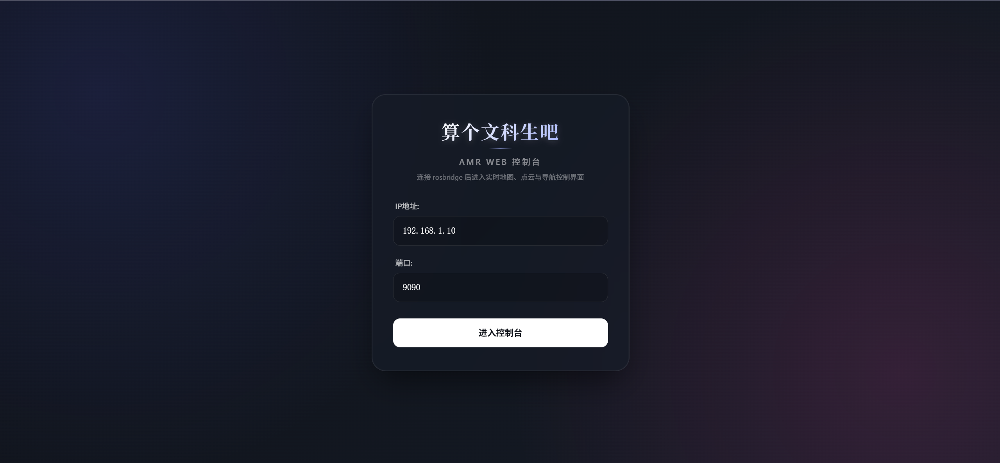
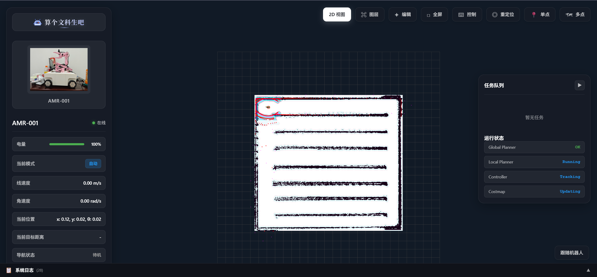
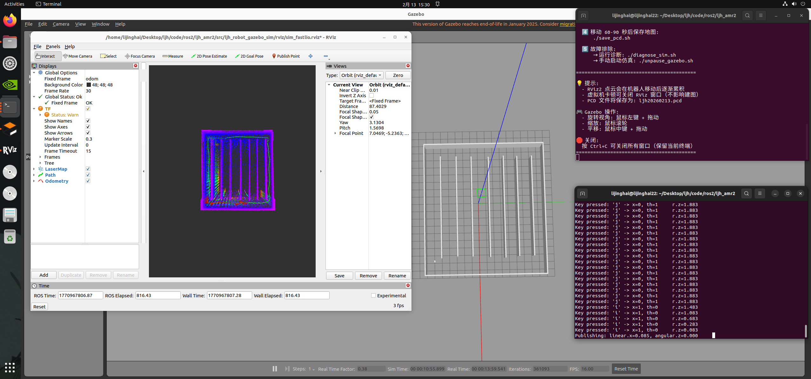
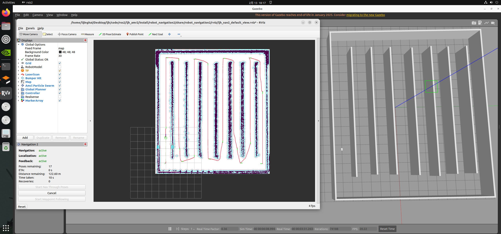
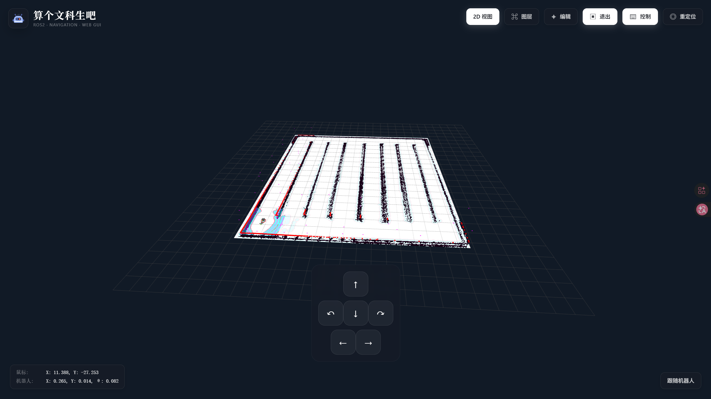
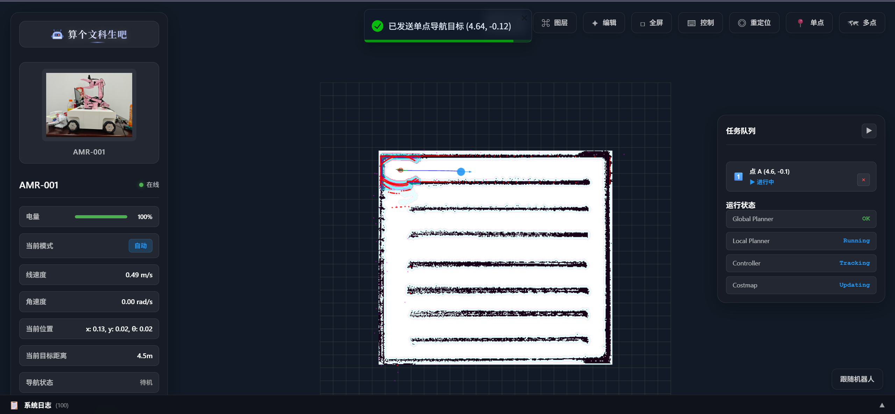
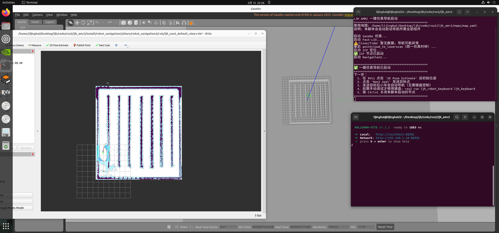
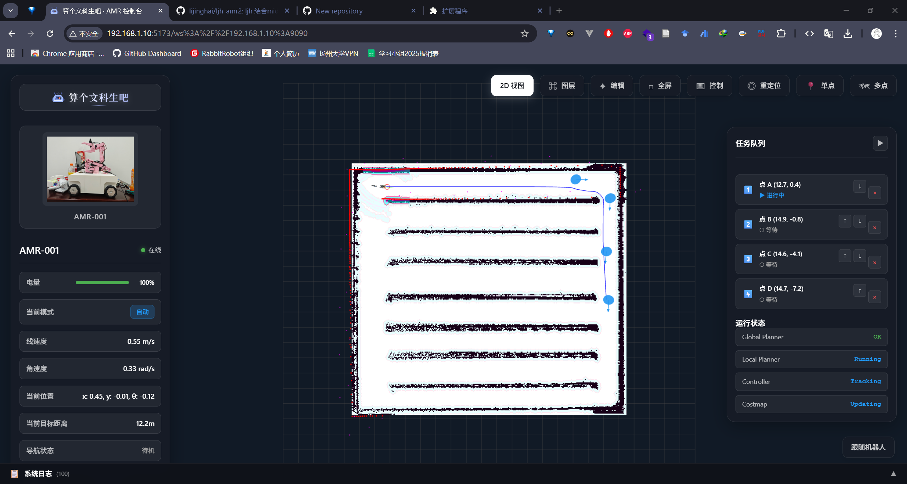
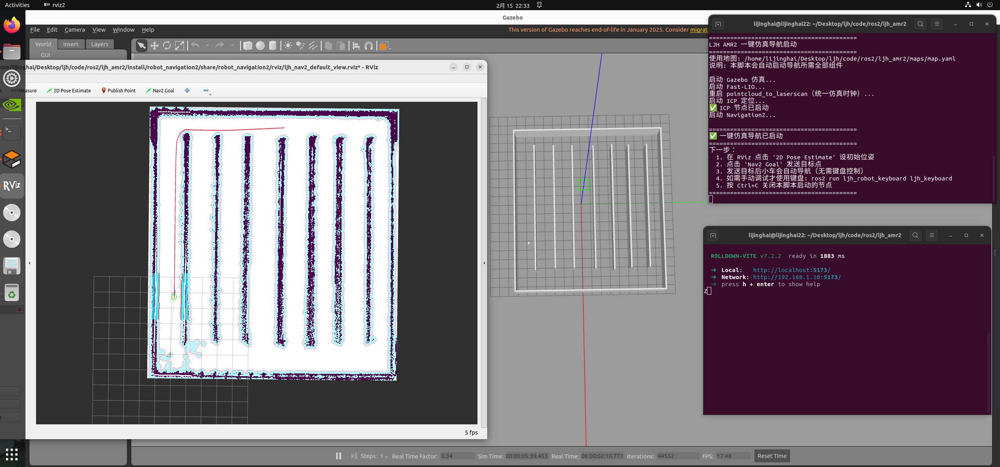

## 🎯 项目简介

<div align="center">

### 算个文科生吧 · AMR 控制台

</div>

**AMR 控制台** 是一个基于 Web 技术的机器人控制与可视化平台，专为自主移动机器人（AMR）设计。通过 WebSocket 连接 ROS 系统，提供实时 3D 可视化、地图编辑、导航控制、任务管理等核心功能，让机器人操作变得直观高效。

### 核心优势

- 🌐 **零安装部署** - 纯 Web 应用，无需安装客户端
- 🎨 **现代化 UI** - 基于 React 19 构建的响应式界面
- 🚀 **高性能渲染** - Three.js 驱动的实时 3D 可视化
- 🔌 **ROS 集成** - 完整的 ROS/ROS2 消息支持
- 🎛️ **灵活配置** - 可自定义的图层系统和主题

### 界面预览

#### 登录页面

<div align="center">
  
</div>

#### 主界面

<div align="center">
  
</div>

---

## ✨ 功能特性

### 🗺️ 地图可视化

- **多图层系统** - 支持栅格地图、代价地图、激光扫描、点云、路径等多种图层
- **2D/3D 视图切换** - 灵活的视角切换，满足不同场景需求
- **实时更新** - 基于 WebSocket 的实时数据流，低延迟可视化
- **图层管理** - 独立的图层控制面板，支持显示/隐藏、透明度、颜色等配置

<div align="center">
  
  <p><em>建图功能界面</em></p>
</div>

### 🎮 机器人控制

- **导航控制** - 支持目标点导航、路径规划与跟踪
- **手动控制** - 实时速度控制面板，支持线速度和角速度调节
- **重定位功能** - 可视化重定位，支持在地图上直接设置机器人初始位姿
- **紧急停止** - 一键紧急停止功能，保障安全

<div align="center">
  
  <p><em>导航控制界面</em></p>
</div>

<div align="center">
  
  <p><em>Web端导航界面</em></p>
</div>

### 📝 地图编辑

- **交互式编辑** - 直接在 3D 场景中编辑地图
- **地图导入/导出** - 支持地图文件的导入和导出
- **拓扑地图** - 支持拓扑地图的创建和管理

### 📊 监控与日志

- **设备信息面板** - 实时显示机器人状态、电池、速度、位置等信息
- **系统日志** - 完整的系统日志记录和查看
- **任务管理** - 任务创建、执行和监控

### 🔧 高级功能

- **URDF 模型加载** - 支持加载和显示机器人 URDF 模型
- **TF 变换可视化** - 实时显示 ROS TF 坐标系关系
- **话题自动适配** - 智能检测可用话题并自动配置图层
- **配置持久化** - 图层配置和用户偏好自动保存

---

## 🏗️ 技术架构

### 技术栈

| 类别 | 技术 | 版本 |
|:----:|:----:|:----:|
| **前端框架** | React | 19.2.0 |
| **语言** | TypeScript | 5.9.3 |
| **构建工具** | Vite (rolldown) | 7.2.2 |
| **3D 渲染** | Three.js | 0.181.1 |
| **ROS 通信** | roslib | 1.4.1 |
| **消息序列化** | @lichtblick/rosmsg* | 1.0.x |
| **UI 组件** | React Toastify | 11.0.5 |
| **测试框架** | Vitest | 4.0.18 |

### 架构设计

```
┌─────────────────────────────────────────────────┐
│              Web Browser (Client)                │
├─────────────────────────────────────────────────┤
│  React UI Layer                                 │
│  ├── ConnectionPage (连接管理)                  │
│  ├── MapView (主视图)                           │
│  ├── LayerSettingsPanel (图层配置)              │
│  ├── NavigationPanel (导航控制)                 │
│  └── DeviceInfoPanel (设备监控)                 │
├─────────────────────────────────────────────────┤
│  Business Logic Layer                           │
│  ├── RosbridgeConnection (ROS 连接)             │
│  ├── TF2JS (坐标变换)                           │
│  ├── LayerManager (图层管理)                    │
│  └── MapManager (地图管理)                      │
├─────────────────────────────────────────────────┤
│  Rendering Layer                                │
│  ├── Three.js Scene (3D 场景)                  │
│  └── Layer Components (图层组件)                │
└─────────────────────────────────────────────────┘
                    ↕ WebSocket
┌─────────────────────────────────────────────────┐
│         ROS/ROS2 System (Robot)                 │
│  ├── rosbridge_server                           │
│  ├── Navigation Stack                           │
│  └── Sensor Topics                              │
└─────────────────────────────────────────────────┘
```

### 核心模块

- **RosbridgeConnection** - 封装 ROS WebSocket 连接，提供订阅/发布接口
- **TF2JS** - TF 变换管理，支持坐标转换和变换树可视化
- **LayerManager** - 图层生命周期管理，支持动态添加/移除图层
- **MapManager** - 地图数据管理，支持导入/导出和编辑

---

## 🚀 快速开始

### 环境要求

- **Node.js**: >= 20.19.0 或 >= 22.12.0
- **npm**: >= 9.0.0

### 安装步骤

1. **克隆仓库**

   ```bash
   git clone https://github.com/lijinghai/ljh_robot_ros2_web.git
   cd ljh_robot_web
   ```

2. **安装依赖**

   ```bash
   npm install
   ```

3. **启动开发服务器**

   ```bash
   npm run dev
   ```

4. **访问应用**

   打开浏览器访问 `http://localhost:5173`

### ROS 环境配置

确保你的 ROS 系统已启动 `rosbridge_server`：

```bash
# ROS 1
rosrun rosbridge_server rosbridge_websocket

# ROS 2
ros2 run rosbridge_server rosbridge_websocket
```

默认 WebSocket 地址：`ws://localhost:9090`

---

## 📖 使用指南

### 连接 ROS 系统

1. 在连接页面输入 ROS WebSocket 地址（例如：`ws://192.168.1.100:9090`）
2. 点击"连接"按钮
3. 连接成功后自动跳转到主视图

### 图层配置

1. 打开右侧"图层设置"面板
2. 选择要显示的图层（栅格地图、激光扫描、点云等）
3. 调整图层参数（颜色、透明度、高度等）
4. 配置会自动保存到本地存储

### 导航控制

1. 切换到"导航模式"
2. 在地图上点击目标位置
3. 或使用导航面板输入坐标
4. 机器人将自动规划路径并导航到目标点

#### 单点导航

<div align="center">
  <table>
    <tr>
      <td align="center">
        
        <p><em>Web端单点导航</em></p>
      </td>
      <td align="center">
        
        <p><em>RViz单点导航对比</em></p>
      </td>
    </tr>
  </table>
</div>

#### 多点导航

<div align="center">
  <table>
    <tr>
      <td align="center">
        
        <p><em>Web端多点导航</em></p>
      </td>
      <td align="center">
        
        <p><em>RViz多点导航对比</em></p>
      </td>
    </tr>
  </table>
</div>

### 手动控制

1. 切换到"手动控制模式"
2. 使用控制面板的滑块或键盘快捷键
3. 实时控制机器人的线速度和角速度

### 地图编辑

1. 切换到"地图编辑模式"
2. 使用工具栏工具编辑地图
3. 支持添加/删除障碍物、修改地图数据
4. 编辑完成后可导出地图文件

### 视图切换

- **2D 视图**：俯视角度，适合导航和地图编辑
- **3D 视图**：自由视角，适合查看机器人模型和点云
- 使用鼠标拖拽旋转视角，滚轮缩放

---

## 📁 项目结构

```
ljh_robot_ros2_web/
├── src/
│   ├── components/          # React 组件
│   │   ├── layers/         # 图层组件
│   │   │   ├── BaseLayer.tsx
│   │   │   ├── OccupancyGridLayer.tsx
│   │   │   ├── LaserScanLayer.tsx
│   │   │   ├── RobotLayer.tsx
│   │   │   └── ...
│   │   ├── ConnectionPage.tsx
│   │   ├── MapView.tsx
│   │   ├── NavigationPanel.tsx
│   │   └── ...
│   ├── hooks/              # React Hooks
│   │   ├── useConnectionInit.ts
│   │   ├── useManualControl.ts
│   │   └── ...
│   ├── utils/              # 工具函数
│   │   ├── RosbridgeConnection.ts
│   │   ├── tf2js.ts
│   │   ├── MapManager.ts
│   │   └── ...
│   ├── types/              # TypeScript 类型定义
│   ├── constants/          # 常量配置
│   ├── App.tsx             # 主应用组件
│   └── main.tsx            # 入口文件
├── public/                 # 静态资源
├── doc/                    # 文档和图片
├── package.json
├── vite.config.ts
└── tsconfig.json
```

### 关键文件说明

- **`src/App.tsx`** - 应用根组件，管理连接状态和路由
- **`src/components/MapView.tsx`** - 主视图组件，包含 3D 场景和所有控制面板
- **`src/utils/RosbridgeConnection.ts`** - ROS 连接封装类
- **`src/utils/tf2js.ts`** - TF 变换管理工具
- **`src/components/layers/LayerManager.tsx`** - 图层管理器

---

## 🛠️ 开发指南

### 开发命令

```bash
# 启动开发服务器
npm run dev

# 构建生产版本
npm run build

# 预览生产构建
npm run preview

# 运行测试
npm test

# 运行测试 UI
npm run test:ui

# 代码检查
npm run lint
```

### 添加新图层

1. 在 `src/components/layers/` 创建新的图层类，继承 `BaseLayer`
2. 实现必要的抽象方法
3. 在 `LayerManager.tsx` 中注册新图层
4. 在 `src/constants/layerConfigs.ts` 添加默认配置

### 代码规范

- 使用 TypeScript 严格模式
- 遵循 ESLint 规则
- 组件使用函数式组件和 Hooks
- 使用有意义的变量和函数命名

### 调试技巧

- 使用浏览器开发者工具查看 WebSocket 消息
- 检查控制台日志了解图层状态
- 使用 React DevTools 调试组件状态

---

## 🔧 配置说明

### Vite 配置

开发服务器默认配置：

- 主机：`0.0.0.0`（允许外部访问）
- 端口：`5173`

可在 `vite.config.ts` 中修改。

### 图层配置

图层配置存储在浏览器本地存储中，包括：

- 图层启用/禁用状态
- 话题名称
- 颜色和透明度
- 其他图层特定参数

---

## 🤝 贡献指南

欢迎提交 Issue 和 Pull Request！

1. Fork 本仓库
2. 创建特性分支 (`git checkout -b feature/AmazingFeature`)
3. 提交更改 (`git commit -m 'Add some AmazingFeature'`)
4. 推送到分支 (`git push origin feature/AmazingFeature`)
5. 开启 Pull Request

---

## 📊 Star 历史

[](https://star-history.com/#lijinghai/ljh_robot_web&Date)

---

## 📄 许可证

本项目采用 [MIT License](LICENSE) 许可证。

---

## 🙏 致谢

- [ROS](https://www.ros.org/) - 机器人操作系统
- [Three.js](https://threejs.org/) - 3D 图形库
- [React](https://react.dev/) - UI 框架
- [Vite](https://vitejs.dev/) - 构建工具

---

<div align="center">


## 算个文科生吧

**Made with ❤️ for Robotics**

[返回顶部](#ljh_robot_web)

</div>
